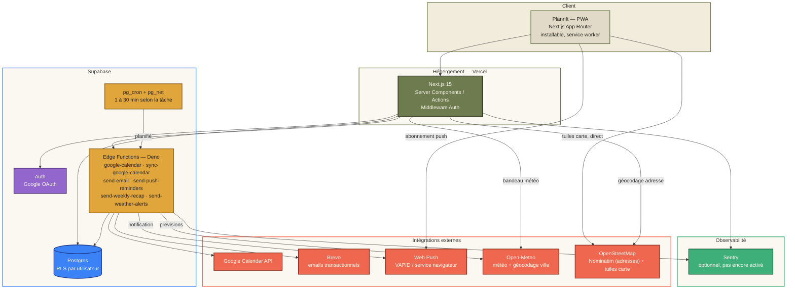

# PlannIt

Planning hebdomadaire mobile-first, installable en PWA, avec sync Google Calendar bidirectionnelle et notifications intelligentes.

Les deux points forts : une **sync Google Calendar bidirectionnelle** avec gestion propre des conflits d'origine (aucune suppression croisée destructrice, auto-réparation des copies effacées côté Google), et la **cascade de retard** — décaler un imprévu recale automatiquement le reste de la journée, ce qu'aucun calendrier mainstream (Google/Apple/Notion) ne propose. Le reste (météo, lieu/trajet, coaching stats) complète l'expérience mais n'est pas l'axe différenciant du projet — voir [Vision & perspectives](#vision--perspectives).

## Fonctionnalités

**Calendrier**
- Sync Google Calendar **bidirectionnelle** : les événements créés dans PlannIt partent vers Google, et ceux créés directement dans Google Calendar (y compris toute la journée) sont importés automatiquement. Auto-réparation si une copie Google est supprimée entre-temps.
- Auth Google OAuth unique (login + accès Google Calendar dans le même écran de consentement)
- Vue semaine, vue mois, vue Stats — navigation illimitée dans le temps
- Types d'activité personnalisables (nom, couleur, et deux propriétés optionnelles : sensible à la météo / nécessite un lieu — gérables à tout moment dans Réglages)

**Notifications intelligentes**
- **Cascade de retard** : "je suis en retard" décale automatiquement cette activité et toutes celles qui suivent le même jour, avec un délai personnalisable (presets ou saisie libre) — plutôt qu'un recalage manuel un par un. Aucun calendrier mainstream ne le fait.
- Rappels par activité entièrement paramétrables (minute/heure/jour, sans limite) + notification automatique au démarrage de chaque activité — vraies push notifications serveur, fonctionnent app fermée et écran verrouillé.
- Alertes météo : pluie prévue avant une activité sensible à la météo (tap → écran mascotte avec option de décalage), et alerte température ambiante indépendante (forte chaleur / froid vif, une fois par jour).
- Lieu & temps de trajet : pour une activité qui le demande, recherche d'adresse, carte, distance et temps de trajet estimé à pied/vélo/voiture depuis la position actuelle, heure de départ suggérée.
- Bandeau météo 24h défilant, visible en permanence sur Semaine/Mois/Stats.

**Coaching passif**
- La vue Stats compare le mois en cours au précédent et signale les tendances (type d'activité en hausse/baisse, plus longue période sans rien de prévu) — un vrai retour sur les habitudes, pas juste un graphique à lire.

**Le reste**
- Emails : bienvenue + résumé hebdomadaire automatique (si activité prévue cette semaine-là)
- PWA installable, thème clair/sombre, avatar de profil

## Architecture



## Vision & perspectives

Le marché du calendrier (Google, Apple, Notion Calendar) est saturé et dominé par des acteurs installés — un calendrier générique de plus n'a aucune raison de gagner. La différenciation de PlannIt n'est pas fonctionnelle par défaut, elle doit être stratégique.

**Priorité retenue après une revue critique honnête des fonctionnalités construites** : la **cascade de retard** est le seul axe qu'aucun concurrent (Google, Apple, Notion) ne propose — c'est là que l'effort produit doit se concentrer. Les alertes météo/trajet, elles, dupliquent partiellement des fonctionnalités déjà mieux intégrées ailleurs (Apple/Google Weather pour les alertes ambiantes, "heure de départ" avec vrai trafic dans Google Calendar) ; elles restent utiles pour l'angle "lié précisément à ton agenda", mais ne sont plus la priorité d'investissement.

**Prochaines étapes envisagées, dans cet ordre :**
1. Conscience des collisions dans la cascade de retard (événements "non déplaçables", pour ne jamais créer de chevauchement en décalant)
2. Détection proactive du retard (l'app propose le décalage d'elle-même plutôt que d'attendre que l'utilisateur ouvre l'app)
3. Délai suggéré personnalisé, appris des habitudes réelles de l'utilisateur (exploite les Stats déjà construites)
4. Perturbations de transport en Île-de-France (API RATP/PRIM) — en attente d'une clé API PRIM
5. Choix définitif d'une niche cible (étudiants, suivi médical, freelances…) pour orienter le produit vers un public précis plutôt que généraliste

## Stack technique

**Frontend** — Next.js 15 (App Router) · TypeScript · Tailwind CSS v4 · Zustand · Recharts · Leaflet/react-leaflet

**Backend** — Supabase (Postgres, Auth, Row Level Security, Edge Functions Deno, pg_cron/pg_net)

**Intégrations** — Google Calendar API · Brevo (email transactionnel) · Web Push (VAPID) · Open-Meteo (météo + géocodage) · OpenStreetMap/Nominatim (adresses + fond de carte)

**Infra** — Vercel (hosting front) · Supabase Cloud (hosting back) · Sentry (monitoring, configuré non activé)

---

## Documentation technique

Déployé : [https://plann-it-cyan.vercel.app](https://plann-it-cyan.vercel.app).

### Démarrer en local

```bash
npm install
npm run dev
```

`.env.local` contient déjà les valeurs Supabase du projet, y compris `SUPABASE_SERVICE_ROLE_KEY` (secret, jamais `NEXT_PUBLIC_`, utilisé uniquement par `app/auth/callback/route.ts` pour stocker les tokens Google Calendar — RLS interdit délibérément cette écriture à l'utilisateur authentifié lui-même).

### Authentification : Google OAuth uniquement

Un seul bouton "Continuer avec Google" (`features/auth/actions.ts` → `signInWithGoogle`). Ce même clic couvre connexion **et** autorisation Google Calendar (scope `calendar.events`, `access_type=offline` + `prompt=consent`) — un seul écran de consentement, pas deux flux séparés. `app/auth/callback/route.ts` capture `provider_token`/`provider_refresh_token` juste après l'échange du code (seul moment où ils sont disponibles) et les stocke via un client `service_role` (`lib/supabase/admin.ts`), puis route vers `/complete-profile` → `/onboarding` → `/dashboard` selon l'état du compte.

### Schéma Supabase & Edge Functions

17 migrations (`supabase/migrations/`) appliquées, 7 Edge Functions déployées sur le projet `foukyqukmutuciunctbi` : `google-calendar-oauth` (déconnexion uniquement), `google-calendar` (sync CRUD PlannIt → Google), `sync-google-calendar` (sync retour Google → PlannIt, cron toutes les 10 min), `send-email` (bienvenue), `send-push-reminders` (cron chaque minute), `send-weekly-recap` (cron toutes les 15 min, n'agit que lundi 00h-01h Paris), `send-weather-alerts` (cron toutes les 30 min, pluie + température).

### Sync Google Calendar — dans les deux sens

- **PlannIt → Google** (existant) : chaque création/modif/suppression dans PlannIt appelle `google-calendar` (`lib/google/edge-functions.ts` → `syncEventToGoogle`), qui répercute côté Google et tient `google_calendar_event_map` à jour. **Auto-réparation** : si une modification vise un événement dont la copie Google a été supprimée directement là-bas (mapping absent, Google renvoie 404/410, ou l'événement existe encore mais `status:"cancelled"` — suppression "douce" fréquente côté Google, pas toujours une vraie erreur HTTP), l'Edge Function le **recrée** côté Google plutôt que d'échouer silencieusement.
- **Google → PlannIt** (`sync-google-calendar`) : toutes les 10 min, utilise le `syncToken` officiel de l'API Calendar (incrémental — inclut les suppressions, contrairement à un simple `events.list` borné par date) pour importer tout événement créé/modifié/supprimé directement dans Google Calendar, y compris toute la journée (représenté comme un bloc minuit-à-minuit à Paris, le schéma `events` n'ayant pas cette notion nativement). Premier sync borné à J-60/J+180. `syncToken` invalide (410) → réinitialisé, resync complet au passage suivant. Ne remonte que l'agenda `primary` du compte connecté.
- Les deux sens partagent la même table de correspondance (`google_calendar_event_map`) — pas de double-import ni de boucle.
- **Asymétrie volontaire sur les suppressions** (`events.synced_from_google`) : une suppression côté Google n'efface la copie PlannIt que si Google en était l'origine (import). Un événement créé dans PlannIt reste sa propriété même si sa copie Google disparaît — recréée au prochain edit, jamais supprimée à cause d'un geste fait côté Google.

```bash
npx supabase login
npx supabase link --project-ref <ref>
npx supabase db push
npx supabase functions deploy <nom-de-la-fonction>
npx supabase gen types typescript --linked > lib/supabase/database.types.ts
```

⚠️ Sous PowerShell, ne pas rediriger `>` directement vers un fichier `.ts` sans préciser l'encodage (UTF-16 par défaut, illisible par TypeScript). Utiliser Bash, ou `| Out-File -Encoding utf8 ...`.

Secrets Edge Functions déjà configurés : `GOOGLE_CLIENT_ID`/`GOOGLE_CLIENT_SECRET`, `BREVO_API_KEY`/`BREVO_SENDER_EMAIL`/`BREVO_SENDER_NAME`, `VAPID_PUBLIC_KEY`/`VAPID_PRIVATE_KEY`/`VAPID_SUBJECT`, `CRON_SECRET`. `SITE_URL` réutilisé pour construire les liens dans les emails. `SENTRY_DSN` pas encore configuré (optionnel).

### Fuseau horaire

Toute résolution de date "aujourd'hui" / bornes de semaine-mois-année passe par `lib/utils/date.ts` (`APP_TIME_ZONE = "Europe/Paris"`, via `date-fns-tz`) — jamais un `new Date()` nu côté serveur, dont l'horloge ambiante (Vercel tourne en UTC) diverge de l'heure de Paris pendant les fenêtres de changement de jour. Les dates voyagent entre serveur et client sous forme de string `yyyy-MM-dd` pure, jamais d'instant sérialisé (cf. commentaires du fichier pour le piège exact évité).

### Emails (Brevo)

Bienvenue (1er login) et résumé hebdomadaire (lundi, si ≥1 activité cette semaine, respecte `user_preferences.weekly_recap_enabled`). Templates dans `supabase/functions/_shared/email/templates.ts`, portés depuis `.claude/Design email/design_handoff_emails/`. Clé API Brevo : bien utiliser une clé **API v3** (préfixe `xkeysib-`), pas une clé SMTP (préfixe `xsmtps-`) — les deux sont des credentials distincts chez Brevo.

### Push notifications

Vraies push notifications serveur (fonctionnent app fermée, écran verrouillé, son/vibration natifs — soumis aux réglages système de l'appareil). Toggle dans Réglages → `pushManager.subscribe()` → stocké dans `push_subscriptions`. Rappels entièrement paramétrables (`components/ui/reminder-picker.tsx`, minute/heure/jour, aucun preset figé) + notification automatique et implicite au démarrage de chaque activité (offset `0`, en plus des rappels configurés). Déclenché par `pg_cron` → Edge Function `send-push-reminders` chaque minute. Le service worker (`worker/index.ts`) route chaque tap selon le type de notification (`?event=`, `?weatherAlert=`, `?tempAlert=`) vers l'écran approprié dans `DashboardView`.

### Cascade de retard intelligente

Bouton horloge sur une activité du jour (`components/calendar/delay-button.tsx`, feuille mascotte) → choix rapide 5/10/15/30 min ou délai personnalisé (nombre + min/h) → `applyDelayCascade` (`features/events/actions.ts`) décale cet événement et tous ceux qui suivent **le même jour** (heure de Paris) du même délai **en parallèle** (pas un par un — chaque décalage resynchronise aussi vers Google), réinitialise leurs rappels. N'affecte jamais les jours suivants.

### Coaching passif (Stats)

En vue mois, `app/dashboard/page.tsx` fetch aussi le mois précédent ; `components/calendar/stats-view.tsx` compare et affiche jusqu'à 3 insights : évolution du total, type dont la fréquence a le plus varié (±10% minimum pour être affiché), plus longue période sans activité ce mois-ci. Rien en vue année (comparaison non pertinente).

### Alertes météo

Deux réglages à faire une fois : marquer un type "sensible à la météo" et/ou "nécessite un lieu" (`components/settings/event-types-manager.tsx` dans Réglages — gère tous les types existants, pas seulement ceux créés après coup) et renseigner sa ville dans Réglages (géocodée via Open-Meteo, gratuit, sans clé — `updateWeatherCity`). Toutes les 30 min, `send-weather-alerts` :
- **Pluie avant événement** : vérifie les événements des 4 prochaines heures dont le type est sensible à la météo, pousse une notification si risque de pluie ≥50% ou précipitations ≥0.5 mm (`events.weather_alert_sent`, vérifié une seule fois). Tap → `?weatherAlert=<id>` → `weather-alert-sheet.tsx` (mascotte + décalage rapide, réutilise `applyDelayCascade`).
- **Température ambiante** (indépendante des événements) : max/min prévu sur 6h ; alerte si ≥30°C ou ≤3°C, au plus une fois par jour et par sens (`user_preferences.last_heat_alert_date`/`last_cold_alert_date`). Tap → `?tempAlert=hot|cold` → `temperature-alert-sheet.tsx` (mascotte, message uniquement).

Une seule ville par compte (pas de lieu par événement pour la météo) — limite assumée pour un planning perso.

### Lieu & temps de trajet

Type marqué "nécessite un lieu" → l'événement affiche un champ d'adresse (`components/calendar/location-input.tsx`, recherche Nominatim/OpenStreetMap debounced côté serveur — `lib/geo/geocode.ts`, User-Agent identifiant requis par la politique d'usage Nominatim). Une fois un lieu choisi, `components/calendar/travel-estimate.tsx` :
1. Position actuelle **à la demande** (jamais automatique) — GPS via `navigator.geolocation` en priorité, repli sur géolocalisation IP (`ipapi.co`, appelée côté client pour voir la vraie IP de l'utilisateur) si refusé.
2. **Distance à vol d'oiseau** (`lib/geo/distance.ts`), pas un vrai itinéraire routier — OSRM (routage OSM) n'a qu'une démo publique explicitement "pas pour la production", un vrai routage demanderait une clé payante. Choix assumé : haversine + vitesse moyenne par mode (marche 5, vélo 15, voiture 30 km/h).
3. Carte OpenStreetMap (`location-map.tsx`, Leaflet/react-leaflet, chargée à la demande via `next/dynamic({ssr:false})`) avec deux repères et une ligne pointillée (pas la vraie route).
4. Marche/vélo/voiture + heure de départ suggérée.

### PWA

`@ducanh2912/next-pwa` (build Webpack requis, pas Turbopack — `"build": "next build"` dans `package.json`). Service worker personnalisé (`worker/index.ts`, gère `push`/`notificationclick`) injecté via `customWorkerSrc`. Prompt d'installation dans l'onboarding + Réglages (`components/pwa/`).

### Structure

```
app/            routes Next.js (App Router)
components/     UI (ui/, calendar/, settings/, onboarding/, pwa/...)
features/       logique métier par domaine (auth, calendar, events, profile, notifications)
lib/            clients Supabase, utils (date/fuseau, reminders, url, geo/météo)
stores/         état Zustand (UI transitoire)
supabase/       migrations SQL + Edge Functions Deno
worker/         service worker personnalisé (push notifications)
```

Design system : `.claude/Design app PlannIt/design_handoff_plannit/`. Design emails : `.claude/Design email/design_handoff_emails/`.

### Déploiement — reste à faire côté utilisateur

1. **Vercel** (dashboard → Settings → Environment Variables) : `NEXT_PUBLIC_SITE_URL=https://plann-it-cyan.vercel.app`, `SUPABASE_SERVICE_ROLE_KEY`, `NEXT_PUBLIC_VAPID_PUBLIC_KEY`.
2. **Supabase Auth** (dashboard → Authentication → URL Configuration) : ajouter `https://plann-it-cyan.vercel.app/**` aux Redirect URLs.
3. **Google Cloud Console** : rien à changer.
