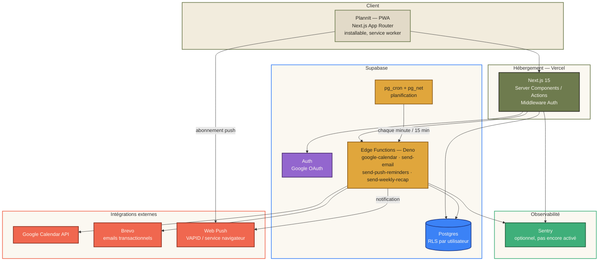

# PlannIt

Planning hebdomadaire mobile-first, installable en PWA, avec sync Google Calendar — pensé pour devenir un calendrier qui réagit au monde réel, pas juste un agenda de plus.

## Vision

Le marché du calendrier (Google, Apple, Notion Calendar) est saturé et dominé par des acteurs installés — un calendrier générique de plus n'a aucune raison de gagner. La différenciation de PlannIt n'est pas fonctionnelle, elle est stratégique : **viser une niche précise** (étudiants en révision, suivi médical récurrent, freelances — à trancher) plutôt que "tout le monde", et se démarquer sur trois axes qu'aucun calendrier mainstream ne couvre aujourd'hui :

1. **Cascade de retard intelligente** — en retard sur un rendez-vous, PlannIt propose de décaler le reste de la journée automatiquement, au lieu de forcer un recalage manuel événement par événement.
2. **Signal temps réel** — le planning réagit au monde réel : météo (partout, via Open-Meteo) et perturbations de transport (Île-de-France, via l'API RATP/PRIM) pour suggérer de partir plus tôt ou décaler une activité en plein air.
3. **Coaching passif** — les statistiques déjà présentes dans l'app (répartition par type, jours actifs) deviennent un vrai retour sur les habitudes ("40% de sport en moins que le mois dernier"), pas juste un graphique à consulter.

Détail complet de cette feuille de route : mémoire projet `project_roadmap.md`.

## Versions & fonctionnalités

**Aujourd'hui (en production)**
- Auth Google OAuth unique (login + accès Google Calendar dans le même écran de consentement)
- Vue semaine, vue mois, vue Stats (répartition par type, tendances, graphiques) — navigation illimitée dans le temps
- Événements avec types/couleurs personnalisables, rappels entièrement paramétrables (minute/heure/jour, aucune limite)
- Push notifications serveur (fonctionnent app fermée, écran verrouillé) + notification automatique au démarrage de chaque activité
- **Sync Google Calendar bidirectionnelle**, avec auto-réparation (un événement PlannIt supprimé côté Google est recréé à la prochaine modif) et import des événements créés directement dans Google, y compris toute la journée
- **Cascade de retard intelligente** : "je suis en retard" décale automatiquement le reste des activités du jour, plutôt qu'un recalage manuel un par un
- **Coaching passif** : la vue Stats compare au mois précédent et signale les tendances (type en hausse/baisse, plus longue période sans activité) — pas juste des graphiques à lire
- **Alertes météo** : types marqués "sensible à la météo" (ex. Sport) déclenchent une notification si pluie prévue avant l'activité ; alerte température ambiante indépendante (forte chaleur ≥30°C, froid vif ≤3°C, une fois par jour) — tap sur la notif → écran mascotte interactif, pas juste un modal d'édition
- **Bandeau météo 24h défilant**, visible en permanence sur Semaine/Mois/Stats
- **Lieu + temps de trajet** : types marqués "nécessite un lieu" (ex. Sport, Travail) demandent une adresse (Nominatim/OpenStreetMap) ; distance à vol d'oiseau + estimation à pied/vélo/voiture depuis la position actuelle (GPS, repli IP), carte OpenStreetMap intégrée, suggestion d'heure de départ
- Emails : bienvenue + résumé hebdomadaire automatique (si activité prévue cette semaine-là)
- PWA installable, thème clair/sombre, avatar de profil

**À venir**
- Perturbations de transport en Île-de-France (API RATP/PRIM) — bloqué en attente d'une clé API à créer par l'utilisateur sur le portail PRIM (Île-de-France Mobilités)
- Vrai routage (itinéraire réel, pas à vol d'oiseau) — nécessiterait un service de routage payant, écarté pour l'instant au profit d'une estimation gratuite
- Choix définitif d'une niche cible, pour orienter ces axes vers un public précis plutôt que généraliste

## Stack technique

**Frontend** — Next.js 15 (App Router) · TypeScript · Tailwind CSS v4 · Zustand · Recharts · Leaflet/react-leaflet

**Backend** — Supabase (Postgres, Auth, Row Level Security, Edge Functions Deno, pg_cron/pg_net)

**Intégrations** — Google Calendar API · Brevo (email transactionnel) · Web Push (VAPID) · Open-Meteo (météo + géocodage) · OpenStreetMap/Nominatim (adresses + fond de carte)

**Infra** — Vercel (hosting front) · Supabase Cloud (hosting back) · Sentry (monitoring, configuré non activé)

## Architecture



---

## Documentation technique

Déployé : [https://plann-it-cyan.vercel.app](https://plann-it-cyan.vercel.app).

### Démarrer en local

```bash
npm install
npm run dev
```

`.env.local` contient déjà les valeurs Supabase du projet, y compris `SUPABASE_SERVICE_ROLE_KEY` (secret, jamais `NEXT_PUBLIC_`, utilisé uniquement par `app/auth/callback/route.ts` pour stocker les tokens Google Calendar — RLS interdit délibérément cette écriture à l'utilisateur authentifié lui-même).

### Authentification : Google OAuth uniquement

Un seul bouton "Continuer avec Google" (`features/auth/actions.ts` → `signInWithGoogle`). Ce même clic couvre connexion **et** autorisation Google Calendar (scope `calendar.events`, `access_type=offline` + `prompt=consent`) — un seul écran de consentement, pas deux flux séparés. `app/auth/callback/route.ts` capture `provider_token`/`provider_refresh_token` juste après l'échange du code (seul moment où ils sont disponibles) et les stocke via un client `service_role` (`lib/supabase/admin.ts`), puis route vers `/complete-profile` → `/onboarding` → `/dashboard` selon l'état du compte.

### Schéma Supabase & Edge Functions

17 migrations (`supabase/migrations/`) appliquées, 7 Edge Functions déployées sur le projet `foukyqukmutuciunctbi` : `google-calendar-oauth` (déconnexion uniquement), `google-calendar` (sync CRUD PlannIt → Google), `sync-google-calendar` (sync retour Google → PlannIt, cron toutes les 10 min), `send-email` (bienvenue), `send-push-reminders` (cron chaque minute), `send-weekly-recap` (cron toutes les 15 min, n'agit que lundi 00h-01h Paris), `send-weather-alerts` (cron toutes les 30 min).

### Sync Google Calendar — dans les deux sens

- **PlannIt → Google** (existant) : chaque création/modif/suppression dans PlannIt appelle `google-calendar` (`lib/google/edge-functions.ts` → `syncEventToGoogle`), qui répercute côté Google et tient `google_calendar_event_map` à jour. **Auto-réparation** : si une modification vise un événement dont la copie Google a été supprimée directement là-bas (mapping absent ou Google renvoie 404/410), l'Edge Function le **recrée** côté Google plutôt que d'échouer silencieusement — un événement PlannIt ne peut plus rester "orphelin" côté Google après une modif.
- **Google → PlannIt** (`sync-google-calendar`) : toutes les 10 min, utilise le `syncToken` officiel de l'API Calendar (incrémental — inclut les suppressions, contrairement à un simple `events.list` borné par date) pour importer tout événement créé/modifié/supprimé directement dans Google Calendar. Rappels par défaut appliqués aux imports (`user_preferences.default_reminders`) — sauf pour les événements toute la journée (`reminders: []`, un rappel "30 min avant minuit" n'a pas de sens ; seule la notification automatique de démarrage s'applique). **Événements toute la journée supportés** : le schéma `events` n'a pas cette notion nativement, donc représentés comme un bloc couvrant exactement ces jours-là à Paris (`resolveEventRange` dans `sync-google-calendar/index.ts`). Premier sync borné à J-60/J+180 (au-delà, un événement Google resterait invisible — limite assumée pour un planning perso, pas un vrai agenda d'entreprise). `syncToken` invalide (410) → réinitialisé, resync complet au passage suivant. Ne remonte que l'agenda `primary` du compte connecté, pas les agendas secondaires/partagés.
- Les deux sens partagent la même table de correspondance (`google_calendar_event_map`), donc pas de double-import ni de boucle : un événement créé dans PlannIt et vu ensuite dans le flux Google est reconnu comme déjà connu, jamais réimporté.
- **Asymétrie volontaire sur les suppressions** (`events.synced_from_google`) : un événement supprimé côté Google n'efface sa copie PlannIt que s'il provenait lui-même de Google (import). Un événement créé dans PlannIt reste la propriété de PlannIt même si sa copie Google disparaît — il est simplement recréé côté Google au prochain edit (cf. auto-réparation ci-dessus), jamais supprimé de PlannIt à cause d'un geste fait côté Google.

```bash
npx supabase login
npx supabase link --project-ref <ref>
npx supabase db push
npx supabase functions deploy <nom-de-la-fonction>
npx supabase gen types typescript --linked > lib/supabase/database.types.ts
```

⚠️ Sous PowerShell, ne pas rediriger `>` directement vers un fichier `.ts` sans préciser l'encodage (UTF-16 par défaut, illisible par TypeScript). Utiliser Bash, ou `| Out-File -Encoding utf8 ...`.

Secrets Edge Functions déjà configurés : `GOOGLE_CLIENT_ID`/`GOOGLE_CLIENT_SECRET`, `BREVO_API_KEY`/`BREVO_SENDER_EMAIL`/`BREVO_SENDER_NAME`, `VAPID_PUBLIC_KEY`/`VAPID_PRIVATE_KEY`/`VAPID_SUBJECT`, `CRON_SECRET`. `SITE_URL` réutilisé pour construire les liens dans les emails. `SENTRY_DSN` pas encore configuré (optionnel).

### Fuseau horaire

Toute résolution de date "aujourd'hui" / bornes de semaine-mois-année passe par `lib/utils/date.ts` (`APP_TIME_ZONE = "Europe/Paris"`, via `date-fns-tz`) — jamais un `new Date()` nu côté serveur, dont l'horloge ambiante (Vercel tourne en UTC) diverge de l'heure de Paris pendant les fenêtres de changement de jour. Les dates voyagent entre serveur et client sous forme de string `yyyy-MM-dd` pure, jamais d'instant sérialisé (cf. commentaires du fichier pour le piège exact évité).

### Emails (Brevo)

Bienvenue (1er login) et résumé hebdomadaire (lundi, si ≥1 activité cette semaine, respecte `user_preferences.weekly_recap_enabled`). Templates dans `supabase/functions/_shared/email/templates.ts`, portés depuis `.claude/Design email/design_handoff_emails/`. Clé API Brevo : bien utiliser une clé **API v3** (préfixe `xkeysib-`), pas une clé SMTP (préfixe `xsmtps-`) — les deux sont des credentials distincts chez Brevo.

### Push notifications

Vraies push notifications serveur (fonctionnent app fermée, écran verrouillé, son/vibration natifs — soumis aux réglages système de l'appareil). Toggle dans Réglages → `pushManager.subscribe()` → stocké dans `push_subscriptions`. Rappels entièrement paramétrables (`components/ui/reminder-picker.tsx`, minute/heure/jour, aucun preset figé) + notification automatique et implicite au démarrage de chaque activité (offset `0`, en plus des rappels configurés). Déclenché par `pg_cron` → Edge Function `send-push-reminders` chaque minute.

### Cascade de retard intelligente

Bouton horloge sur une activité du jour (`components/calendar/delay-button.tsx`) → choix rapide 5/10/15/30 min → `applyDelayCascade` (`features/events/actions.ts`) décale cet événement et tous ceux qui suivent **le même jour** (heure de Paris) du même délai, réinitialise leurs rappels et resynchronise chacun vers Google. N'affecte jamais les jours suivants.

### Coaching passif (Stats)

En vue mois, `app/dashboard/page.tsx` fetch aussi le mois précédent ; `components/calendar/stats-view.tsx` compare et affiche jusqu'à 3 insights : évolution du total, type dont la fréquence a le plus varié (±10% minimum pour être affiché), plus longue période sans activité ce mois-ci. Rien en vue année (comparaison non pertinente).

### Alertes météo

Deux réglages à faire une fois : marquer un type "sensible à la météo" (case à cocher à la création d'un type, `components/calendar/type-select.tsx`) et renseigner sa ville dans Réglages (géocodée via Open-Meteo, gratuit, sans clé — `updateWeatherCity` dans `app/settings/actions.ts`). Toutes les 30 min, `send-weather-alerts` :
- **Pluie avant événement** : vérifie les événements des 4 prochaines heures dont le type est sensible à la météo, et pousse une notification si risque de pluie ≥50% ou précipitations ≥0.5 mm. Chaque événement n'est vérifié qu'une fois (`events.weather_alert_sent`). Tap sur la notif → `?weatherAlert=<id>` → `components/calendar/weather-alert-sheet.tsx` (mascotte + options de décalage rapide, réutilise `applyDelayCascade`).
- **Température ambiante** (indépendante des événements) : vérifie le max/min prévu dans les 6 prochaines heures ; alerte si ≥30°C (chaleur, "pense à t'hydrater") ou ≤3°C (froid, "pense à te couvrir"), au plus une fois par jour et par sens (`user_preferences.last_heat_alert_date`/`last_cold_alert_date`). Tap → `?tempAlert=hot|cold` → `components/calendar/temperature-alert-sheet.tsx` (mascotte, message uniquement, pas d'action).

Ne gère qu'une seule ville par compte (pas de lieu par événement) — limite assumée pour un planning perso.

### Lieu & temps de trajet

Type marqué "nécessite un lieu" (case à cocher à la création d'un type) → l'événement affiche un champ d'adresse (`components/calendar/location-input.tsx`, recherche Nominatim/OpenStreetMap debounced côté serveur — `lib/geo/geocode.ts`, respecte la politique d'usage Nominatim : User-Agent identifiant, appelé serveur pas client). Une fois un lieu choisi, `components/calendar/travel-estimate.tsx` :
1. Récupère la position actuelle **à la demande** (jamais automatique) — GPS via `navigator.geolocation` en priorité, repli sur géolocalisation IP (`ipapi.co`, approximative) si refusé (`lib/geo/use-current-position.ts`).
2. Calcule la **distance à vol d'oiseau** (`lib/geo/distance.ts`) — **pas un vrai itinéraire routier** : OSRM (routage OpenStreetMap) n'a qu'une démo publique explicitement "pas pour la production", et un vrai service de routage demanderait une clé payante. Choix assumé : distance haversine + vitesse moyenne par mode (marche 5 km/h, vélo 15 km/h, voiture 30 km/h) — fiable, gratuit, mais approximatif.
3. Affiche une carte OpenStreetMap (`components/calendar/location-map.tsx`, Leaflet/react-leaflet, chargée à la demande via `next/dynamic({ssr:false})`) avec deux repères et une ligne pointillée (pas la vraie route) entre position actuelle et lieu de l'événement.
4. Propose marche/vélo/voiture, et calcule l'heure de départ suggérée à partir de l'heure de début de l'activité.

### PWA

`@ducanh2912/next-pwa` (build Webpack requis, pas Turbopack — `"build": "next build"` dans `package.json`). Service worker personnalisé (`worker/index.ts`, gère `push`/`notificationclick`) injecté via `customWorkerSrc`. Prompt d'installation dans l'onboarding + Réglages (`components/pwa/`).

### Structure

```
app/            routes Next.js (App Router)
components/     UI (ui/, calendar/, settings/, onboarding/, pwa/...)
features/       logique métier par domaine (auth, calendar, events, profile, notifications)
lib/            clients Supabase, utils (date/fuseau, reminders, url)
stores/         état Zustand (UI transitoire)
supabase/       migrations SQL + Edge Functions Deno
worker/         service worker personnalisé (push notifications)
```

Design system : `.claude/Design app PlannIt/design_handoff_plannit/`. Design emails : `.claude/Design email/design_handoff_emails/`.

### Déploiement — reste à faire côté utilisateur

1. **Vercel** (dashboard → Settings → Environment Variables) : `NEXT_PUBLIC_SITE_URL=https://plann-it-cyan.vercel.app`, `SUPABASE_SERVICE_ROLE_KEY`, `NEXT_PUBLIC_VAPID_PUBLIC_KEY`.
2. **Supabase Auth** (dashboard → Authentication → URL Configuration) : ajouter `https://plann-it-cyan.vercel.app/**` aux Redirect URLs.
3. **Google Cloud Console** : rien à changer.
